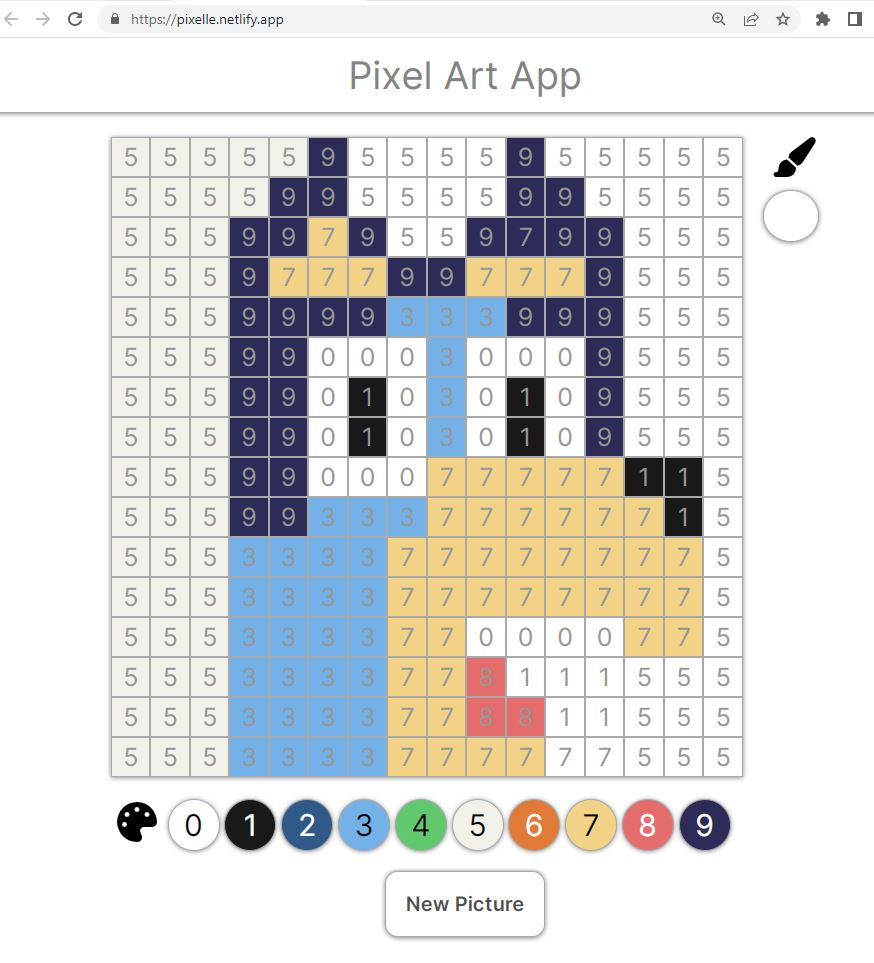

===================
REACT PIXEL ART APP
===================

This 'pixel-art-app' repository holds the source code for a React web application that allows the user to "paint-by-number" a handful of pre-made pictures derived from a 16x16 canvas of "pixel" blocks. Click on a color swatch below the canvas to choose the brush color. Color the "pixels" by matching the number of the paint swatch on the palette to the number on the canvas. The application also supports mouse dragging for coloring multiple pixels per mouse click. 

Explore the app live at: https://pixelle.netlify.app/

Screenshots:

Features: 
  * Dynamically generates canvas and palette from separate file of arrays, allowing easy addition of new paint-by-numbers and new color palettes
  * Font color (white or black) for palette swatches is automatically determined by a formula that calculates a brightness threshold
  * 'New Picture' button increments an index of the pictures, automatically loading a new paint-by-number, the color palette that corresponds to that picture, and resets all the pixels amnd brush color to white.  
  
The app can be run locally in a node.js environment. Simply clone the repository, navigate to the project directory (where the package.json is found) and use the command 'npm start' in the terminal. 

Copyright 2023 Erik M. Paffett
